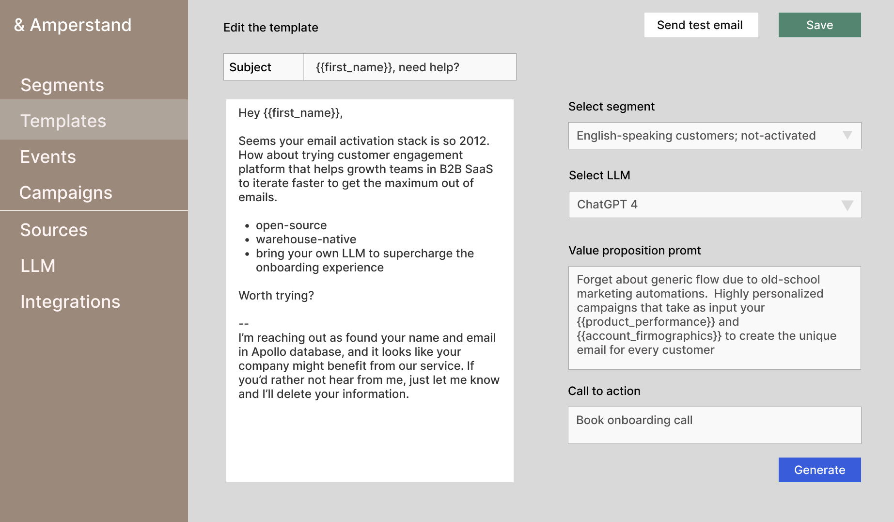
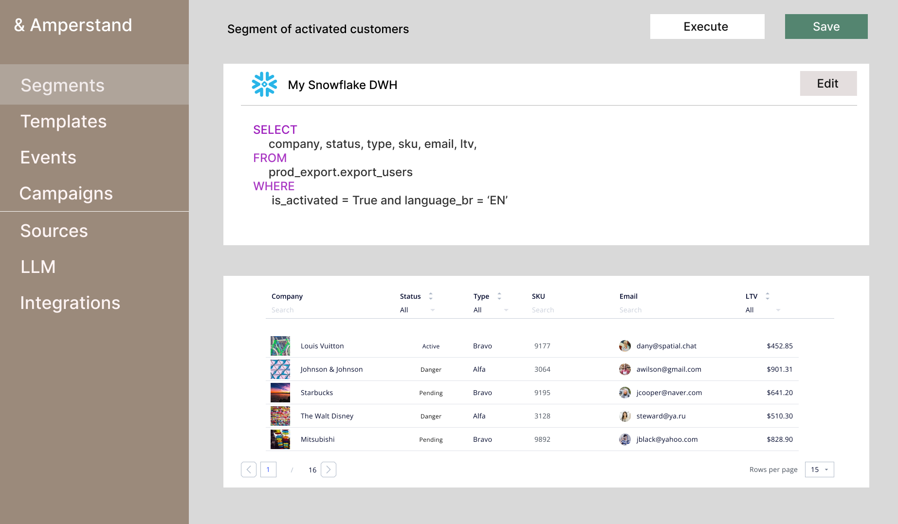
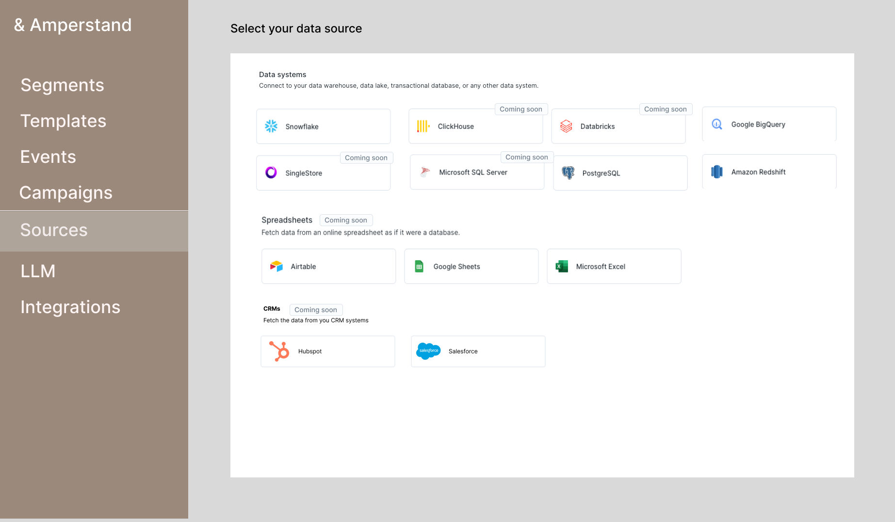
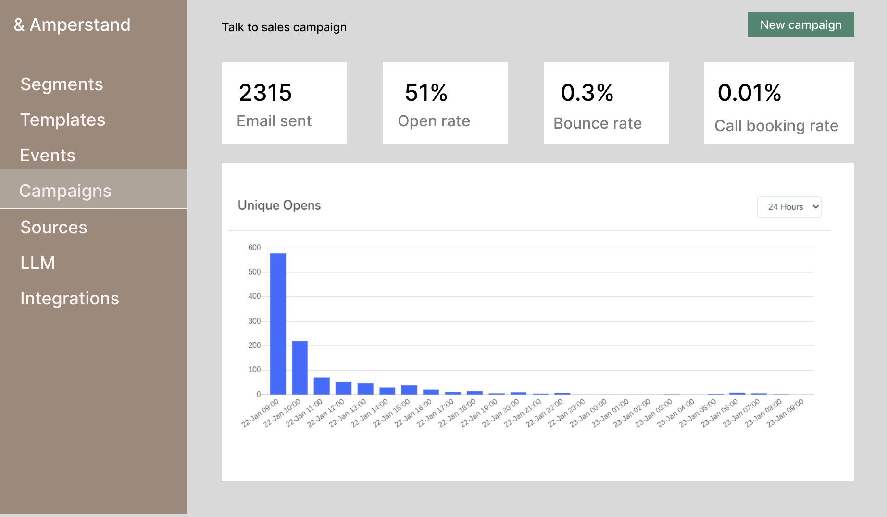
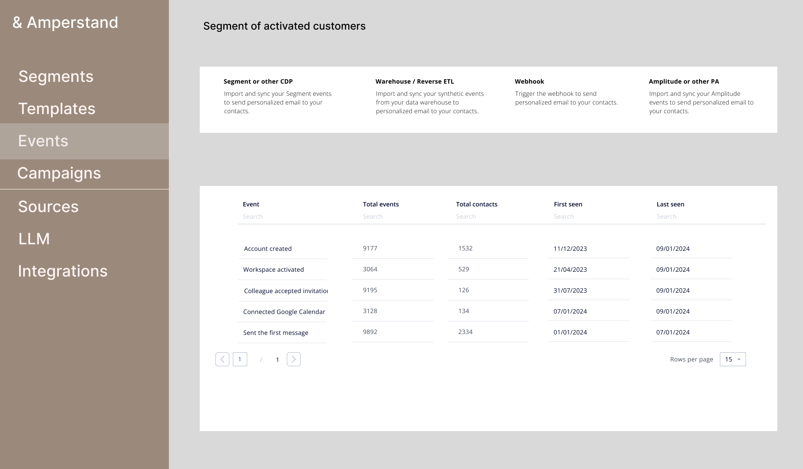

# Amperstand

We are betting on the domain-specific GPTs (read GPT marketplace) dynamics and developing a modern open-source email marketing platform. The platform uses a "bring your own LLM" approach to run your email campaigns. You can have better control over your personal data and transparency while managing costs effectively. 
Amperstand works on top of your SMTP server, like SendGrid, Amazon SES, and Mailgun, and connects directly to your data warehouse to manage campaigns and user segments. This gives you better control over your lifecycle marketing spending.

In version 0.1 of the platform, we only support plain-text emails or templates you created in Sendgrid or Mailgun. Our previous experience lies primarily in B2B SaaS, so we are biased towards this niche. However, the Amperstand design is industry-agnostic and suitable for any modern tech organization.

## Why Amperstand
1. Generic flow due to old-school marketing automation – highly personalized campaigns that take as input your product performance and account demographics, but that into prompt and create the unique email.  
2. Stop asking your data buddy to push the data to Mailchimp – instantly build a segment on top of your warehouse. 
3. Control over "AI" in the product. You may choose the LLM to craft the message or even plug your own trained one. 

## Key features
1. Open source 
2. Bring your own SMTP service provider. Think of Ghost for newsletters, but for whole marketing campaigns. 
3. Bring your model LLM. Prompt-first email design that takes use case, role, and experience level to provide users with personalized email for every customer. 

4. Native connection to DWH with zero data copy

5. You can control your activity data and effortlessly integrate it with your data stack with pre-aggregated data models. 

6. Easily create either campaign, transactional, or event-driven emails.

6. Connect events from Segment, Amplitude, Mixpanel, Jitsu, Rudderstack, Zapier, and Reverse-ETL platforms

-  Management of deliverability and spam

## Feature backlog
- No-code segment builders
- Drag-and-drop campaign builder
- Automatic time scheduler and chaining. 
- Send data back to your CRM
- Webhook-based contacts upload

## Self-hosted features
1. Custom LLM trained specifically for the better onboarding 
2. In-house tech to avoid spam filters and some advice on this matter. 
3. Cloud deployment and maintenance
